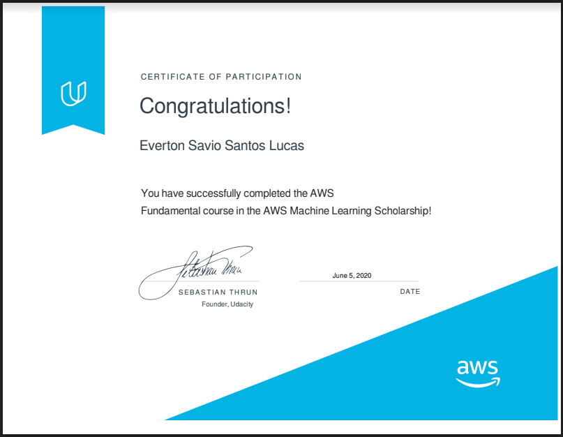

# AWS_ML_Engineer  
  
  
  
### Links:
  
http://engineering.pivotal.io/post/test-driven-development-for-data-science/  
  
https://docs.python-guide.org/writing/tests/  

https://akrabat.com/the-beginners-guide-to-contributing-to-a-github-project/   

https://github.com/MarcDiethelm/contributing/blob/master/README.md  

--------------------------------------
### Quickly Snippets  
```
df['first_name'], df['last_name'] = df['name'].str.split(' ', 1).str
```